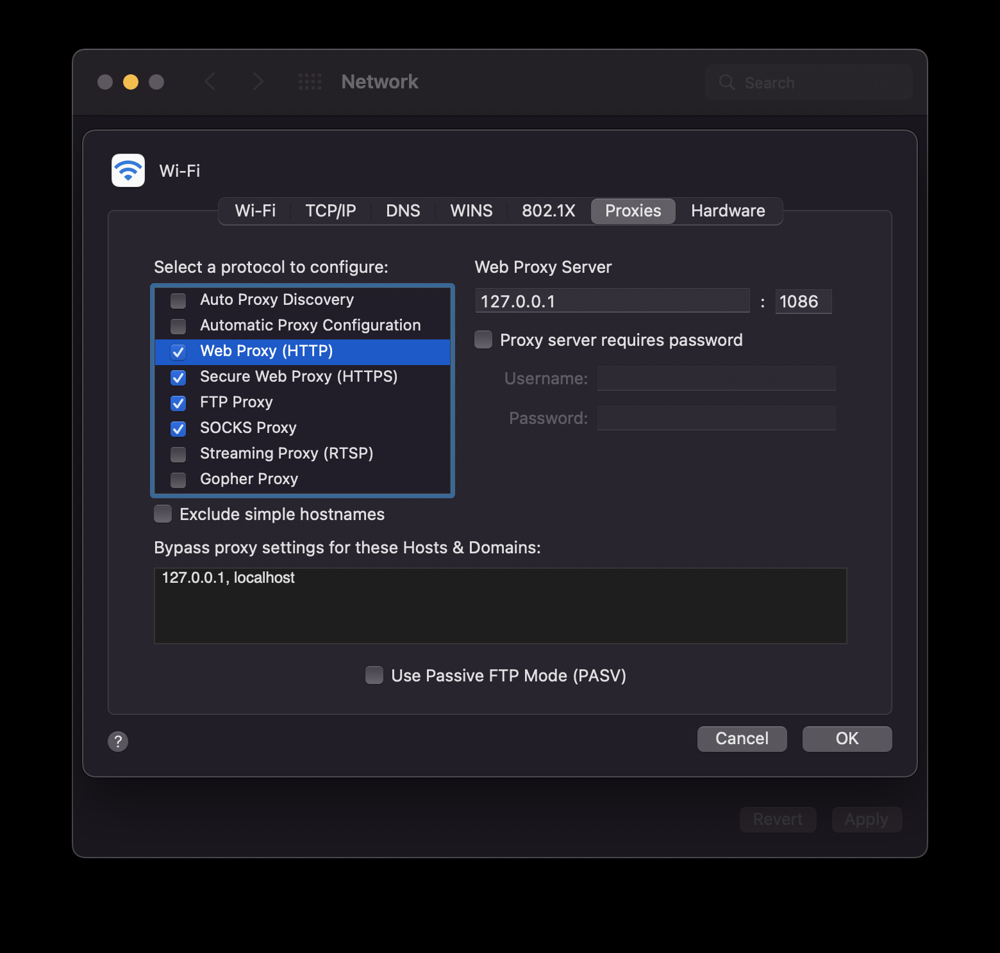

# v2raym

Dead simple v2ray client for MacOS (terminal)

## 0x01. pre-requisites

Have [`v2ray` core binary](https://github.com/v2fly/v2ray-core) installed in your system.

## 0x02. install this `v2raym` script

```bash
curl -sSL "https://raw.githubusercontent.com/ggicci/v2raym/main/v2raym" -o ~/.local/bin/v2raym \
  && chmod +x ~/.local/bin/v2raym
```

## 0x03. environment variables

- **V2RAY_BIN**: path to the v2ray binary, default `"/opt/v2ray/v2ray"`
- **V2RAY_CONFIG**: path to the v2ray config, default: `"${HOME}/.config/v2ray/config.json"`
- **V2RAY_HTTP_PROXY_PORT**: port of the local HTTP/HTTPS/FTP proxy, default: `1086`
- **V2RAY_PROXY_PORT**: port of the local SOCKS proxy, default: `1080`

You can change these variables according to your system settings.

## 0x04. usage

```bash
Usage: v2raym start | stop
```

### `v2raym start`

Start `v2ray` service and configure your system network proxy settings, including HTTP/HTTPS/FTP/SOCKS.



### `v2raym stop`

Stop `v2ray` service and unset the proxy settings of your system network.
